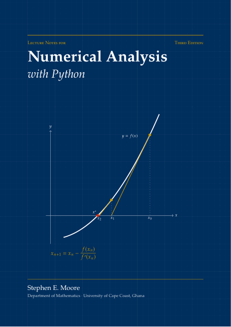

# Lecture Notes for Numerical Analysis with Python

[](LICENSE-BOOK.md)
[](LICENSE)



**Third Edition (2026)** · Stephen E. Moore · Department of Mathematics, University of Cape Coast, Ghana

🌐 **Author's website:** [https://moorestephen.info/](https://moorestephen.info/)
📘 **Download the book (PDF):** [Numerical_Analysis_with_Python_3rd_Edition.pdf](Numerical_Analysis_with_Python_3rd_Edition.pdf)

This repository contains the book and all of its Python programs. The notes were written for
**MAT 407: Numerical Analysis I**, a final-year undergraduate course at the University of Cape Coast,
and they also aim to prepare students for graduate study.

## About the book

Numerical analysis is the study of algorithms for the problems of continuous mathematics: solving
equations, solving linear systems, approximating functions and data, and differentiating and
integrating numerically. For every algorithm the book asks three questions:
*Does it converge? How fast? How reliable is it in floating-point arithmetic?*

Every method is **derived**, **analysed** (with proofs of the main theorems) and **implemented in
Python**. Every Python listing in the book has been run, and the output printed beneath it is the
real output of the program in this repository.

Each chapter contains:

- **Learning objectives** and a **chapter summary**
- worked examples by hand and in Python
- highlighted **Key Concept** boxes (the ideas you must understand)
- **Historical Notes** on the people and problems behind the mathematics
- **Caution** boxes on common mistakes and pitfalls of computer arithmetic
- **Towards Graduate Studies** boxes linking each topic to advanced mathematics
- **exercises after every section**, tagged *Theory*, *Python* and *★ Graduate*, with answers to
  selected exercises in Appendix B

## Contents and code

| Part | Chapter | Code folder | Programs |
|---|---|---|---|
| I. Foundations | 1. Introduction to Python Programming | [`code/ch01`](code/ch01) | basics, vectors, matrices, loops, functions, plotting, the bungee jumper (Euler's method) |
| | 2. Number Systems | [`code/ch02`](code/ch02) | base conversion, integers and two's complement |
| | 3. Floating-Point Arithmetic and Round-off Errors | [`code/ch03`](code/ch03) | IEEE 754 bits, machine epsilon, k-digit arithmetic, cancellation, conditioning, summation, the Patriot missile |
| II. Nonlinear equations | 4. Solutions of Nonlinear Equations | [`code/ch04`](code/ch04) | bisection, fixed point, Newton, secant, regula falsi, Aitken/Steffensen, Newton fractal, SciPy root finders |
| | 5. Systems of Nonlinear Equations | [`code/ch05`](code/ch05) | Newton for systems, Lorenz equilibria, Broyden, `scipy.optimize` |
| III. Linear systems | 6. Direct Methods: LU, Cholesky, QR | [`code/ch06`](code/ch06) | Gaussian elimination, pivoting, LU, tridiagonal (Thomas), Cholesky, Gram–Schmidt QR |
| | 7. Iterative Methods for Linear Systems | [`code/ch07`](code/ch07) | Jacobi, Gauss–Seidel, SOR, steepest descent, conjugate gradients, 2D Poisson problem |
| | 8. Norms, Condition Numbers and Error Estimates | [`code/ch08`](code/ch08) | vector and matrix norms, condition numbers, iterative refinement |
| IV. Approximation | 9. Polynomial Interpolation | [`code/ch09`](code/ch09) | Vandermonde, Lagrange, divided differences, Runge's phenomenon, splines |
| | 10. Least Squares and Orthogonal Polynomials | [`code/ch10`](code/ch10) | line fitting, normal equations vs QR, exponential fits (population of Ghana), Legendre and Chebyshev polynomials |
| | 11. Approximation by Rational Functions | [`code/ch11`](code/ch11) | Padé approximation, Chebyshev rational approximation |
| V. Numerical calculus | 12. Numerical Differentiation | [`code/ch12`](code/ch12) | finite differences, choice of step size, Richardson extrapolation, noisy data, complex step |
| | 13. Numerical Integration and Adaptive Quadrature | [`code/ch13`](code/ch13) | Newton–Cotes, composite rules, Romberg, Gauss–Legendre, adaptive Simpson |

Appendix A of the book is a Python quick reference with MATLAB/Octave equivalents.

Each program `code/chNN/name.py` is **self-contained**. The file `code/chNN/name.out` next to it
contains the output printed in the book, so you can check your results against it.

## Getting started

You need Python 3 with NumPy, SciPy and Matplotlib.

- **Easiest:** install [Anaconda](https://www.anaconda.com/download), which includes everything.
- **No installation:** open [Google Colab](https://colab.research.google.com/), upload a `.py` file
  (or paste its contents into a cell) and run it.
- **With pip:**

```bash
git clone https://github.com/moorekwesi/numerical-analysis-with-python.git
cd numerical-analysis-with-python
pip install -r requirements.txt
```

Run a single program, for example Newton's method from Chapter 4:

```bash
python code/ch04/newton.py
```

Programs that draw figures save them as PDF/PNG files in the folder you run them from.
To run **every** program in the book and regenerate all outputs and figures (in `figures/`):

```bash
python run_all.py          # all chapters
python run_all.py ch04     # only Chapter 4
```

## How to learn from this repository

1. Read a section of the book with the corresponding program open.
2. Run the program and compare your output with the `.out` file.
3. **Change something:** the function, the starting value, the tolerance, the step size. Predict
   what will happen first, then check. This is how numerical analysis is really learned.
4. Attempt the *Python* exercises at the end of each section; most of them start from one of
   these programs.

## Editions

| Edition | Year |
|---|---|
| First edition | 2022 |
| Second edition | 2024 |
| Third edition | 2026 |

## Citing the notes

> S. E. Moore, *Lecture Notes for Numerical Analysis with Python*, 3rd ed., Department of
> Mathematics, University of Cape Coast, Ghana, 2026.
> Available at https://github.com/moorekwesi/numerical-analysis-with-python

## Licence

You are free to use, share and adapt these materials, for teaching, learning or any other
purpose, as long as you give credit to the author.

- **The book** (`Numerical_Analysis_with_Python_3rd_Edition.pdf`) is licensed under the
  [Creative Commons Attribution 4.0 International Licence (CC BY 4.0)](LICENSE-BOOK.md).
- **The Python programs** (`code/` and `run_all.py`) are licensed under the [MIT Licence](LICENSE).

## Author

**Stephen E. Moore**, Department of Mathematics, University of Cape Coast, Ghana
Website: [https://moorestephen.info/](https://moorestephen.info/)

Corrections and suggestions are welcome: please open an
[issue](https://github.com/moorekwesi/numerical-analysis-with-python/issues).
